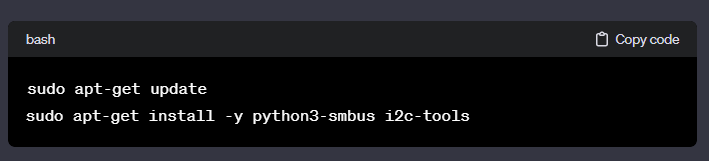

# FinalYearProject 💐💐🌻
 
Google drive : https://drive.google.com/drive/folders/1d33Tf5PzSsmktO_kc8PpvMqW39enUzbr?usp=sharing

Dataset:
Bosch:  https://github.com/boschresearch/CNC_Machining.git
Milling : 1) https://ieee-dataport.org/open-access/roughness-milling-process
          2) https://www.kaggle.com/datasets/ricardofebra/cnc-vibration-monitoring
          3) 

- BackendFile: DataTrans.py
- Mattry.py - configured tha above code based on parameters like materials used and 'good' or 'Bad' classification and added te functionality of putting it into my google drive 
- Mattry2.py - configured tha above code based on parameters like materials used only and has a datasheet that has values of both 'good' and 'bad'

- vaishakh-nambiar@finalyearop.iam.gserviceaccount.com

- https://drive.google.com/drive/folders/1HydWnhc03M59UdBc88fNNnP-KGH4oqGo?usp=sharing

- New acc: vaishn@finalyearproject-410409.iam.gserviceaccount.com
- - https://drive.google.com/drive/folders/1SqzUmCWsy_e9p6GuInBXVJJdDv7eu8Kz?usp=sharing

- DataShow.py - The code for data that we are making 
- Sensor_get.py - The code that we'll show 
 - install these 
